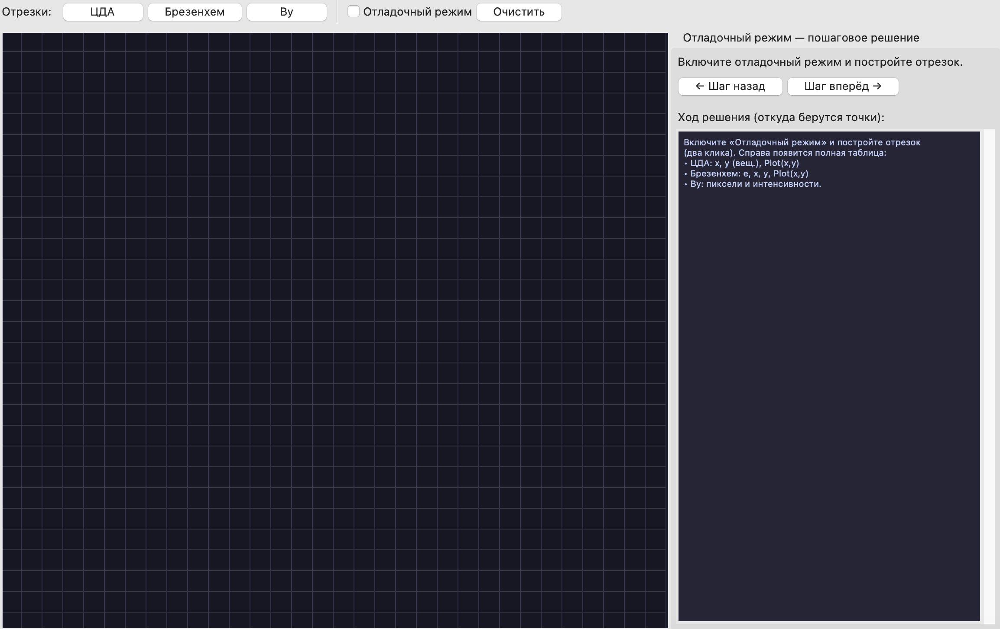
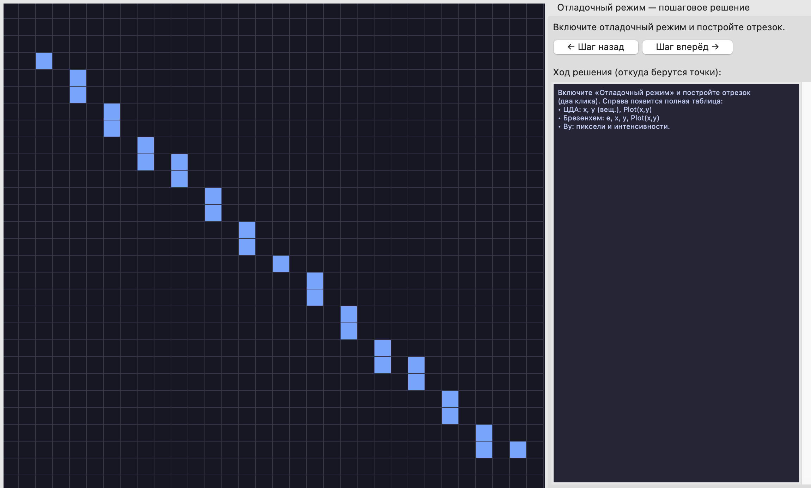
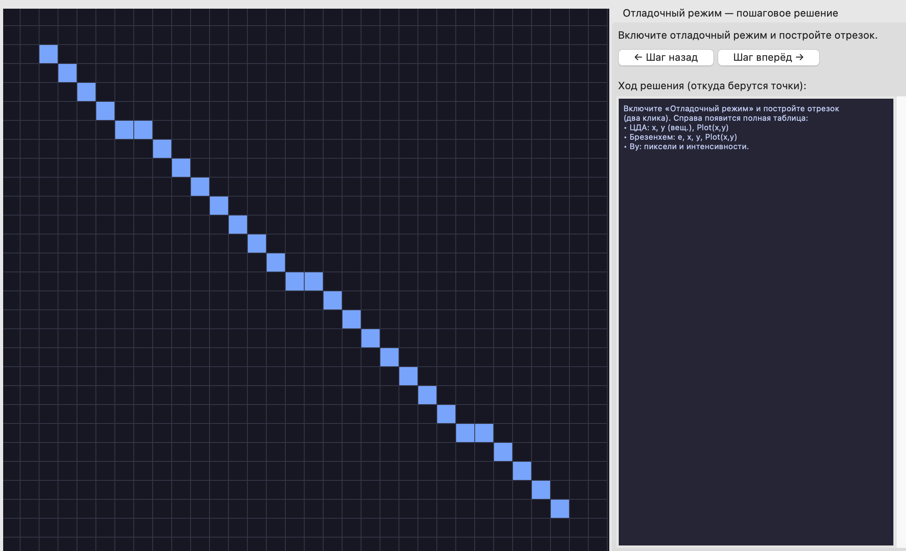
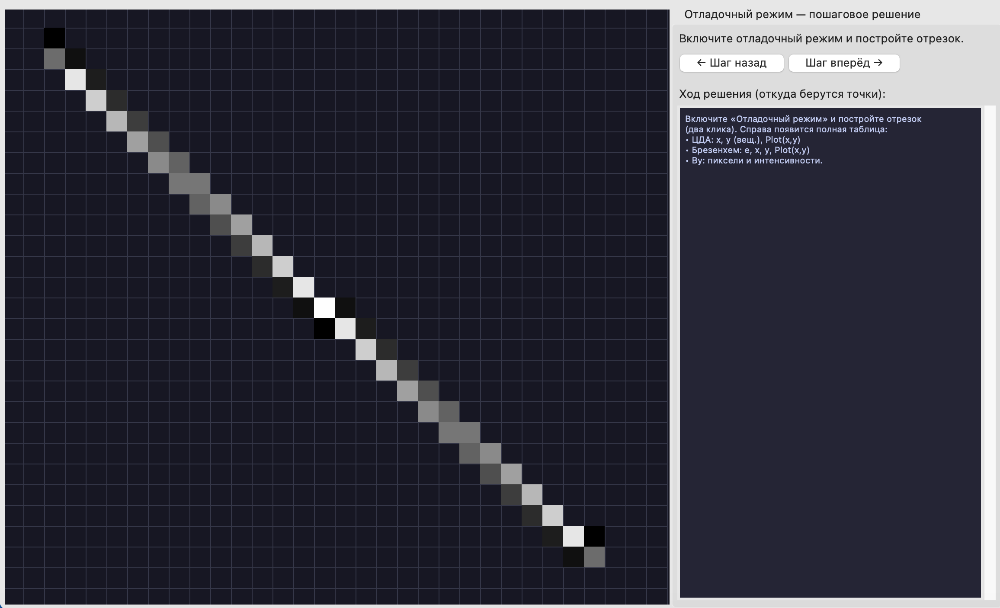

# Отчёт по лабораторной работе №1  
## Построение отрезков в растр

**Дисциплина:** Графический интерфейс интеллектуальных систем и когнитивная графика (или Компьютерная графика)  
**Тема:** Алгоритмы построения отрезков  
**Источник задания:** С. А. Самодумкин, М. Д. Степанова, Д. Г. Колб. Практикум по компьютерной графике. Часть 1. — Минск: БГУИР, 2007.

---

## 1. Цель работы

Разработать элементарный графический редактор, реализующий построение отрезков с помощью:

- алгоритма **ЦДА** (цифровой дифференциальный анализатор);
- **целочисленного алгоритма Брезенхема**;
- **алгоритма Ву** (сглаживание).

Вызов способа генерации отрезка задаётся из пункта меню и доступен через панель инструментов «Отрезки». В редакторе предусмотрен **отладочный режим**, в котором отображается пошаговое решение на дискретной сетке и полная таблица хода решения.

---

## 2. Теоретические сведения

### 2.1. Постановка задачи

Заданы координаты начала (x₁, y₁) и конца (x₂, y₂) отрезка. Экран рассматривается как матрица дискретных элементов (пикселей). Требуется определить набор пикселей, наилучшим образом аппроксимирующих заданный отрезок. Этот процесс называется **разложением в растр**.

### 2.2. Алгоритм ЦДА (цифровой дифференциальный анализатор)

Уравнение прямой в форме приращений:

$$\frac{dy}{dx} = \frac{y_2 - y_1}{x_2 - x_1} = \mathrm{const}$$

Итерационная последовательность (шаг по растру = 1 по большей оси):

- **Шаг 1.** Длина = max(|x₂ − x₁|, |y₂ − y₁|)
- **Шаг 2.** dx = (x₂ − x₁) / Длина,  dy = (y₂ − y₁) / Длина
- **Шаг 3.** Начальные значения: x = x₁ + 0,5·Sign(dx),  y = y₁ + 0,5·Sign(dy). Отобразить Plot(⌊x⌋, ⌊y⌋).
- **Шаг 4.** Цикл по i = 0 … Длина: x = x + dx,  y = y + dy,  Plot(⌊x⌋, ⌊y⌋).

*Integer* — целая часть; *Sign* — знак (−1, 0, 1); *Plot(a, b)* — отображение пикселя (a, b).

**Недостатки:** операции с плавающей точкой, возможное накопление погрешности.

### 2.3. Целочисленный алгоритм Брезенхема

Используются только целочисленные сложение и вычитание. Движение вдоль **основной оси** (где приращение больше) на 1 пиксель; по второй оси — на 0 или ±1 в зависимости от **ошибки** e.

Для первого октанта (0 ≤ Δy/Δx ≤ 1, основная ось — X):

- Начальное значение ошибки: **e = 2·Δy − Δx** (после умножения на 2·Δx сравнение только по знаку).
- На каждом шаге:
  - если **e ≥ 0**: y += sy,  e := e − 2·Δx;
  - e := e + 2·Δy;  x += sx;  Plot(x, y).

Для всех октантов учитываются знаки sx, sy и при |Δy| > |Δx| меняются ролями x и y (движение по Y).

### 2.4. Алгоритм Ву (устранение ступенчатости)

На каждом шаге по основной оси зажигаются **два** пикселя по неосновной оси (например, (x, y) и (x, y+1)). **Интенсивность** каждого пикселя пропорциональна расстоянию от идеальной линии до центра пикселя; сумма интенсивностей двух пикселей равна 1. В результате линия визуально сглаживается (anti-aliasing).

---

## 3. Описание программы

### 3.1. Структура проекта

| Файл | Назначение |
|------|------------|
| `algorithms.py` | Реализации ЦДА, Брезенхема и Ву; функции возвращают список пикселей; пошаговые итераторы `dda_steps`, `bresenham_steps`, `wu_steps` для отладочного режима. |
| `editor.py` | Графический интерфейс (tkinter): окно с меню, панель «Отрезки», холст с дискретной сеткой, отладочная панель с таблицей хода решения. |
| `requirements.txt` | Зависимости не требуются (достаточно стандартной библиотеки Python, tkinter). |

### 3.2. Реализованные требования

- **Меню «Отрезки»:** выбор алгоритма (ЦДА, Брезенхем, Ву), включение/выключение отладочного режима, очистка холста, выход.
- **Панель инструментов «Отрезки»:** те же действия быстрым доступом.
- **Холст:** дискретная сетка (32×32 клетки); два клика задают начало и конец отрезка; отрезок строится выбранным алгоритмом.
- **Отладочный режим:** пошаговое отображение построения последнего отрезка на сетке (кнопки «Шаг назад» / «Шаг вперёд»); справа выводится **полная таблица хода решения** с пояснением, откуда берутся координаты и значения (для ЦДА — x, y вещественные и Plot(x,y); для Брезенхема — e, x, y, Plot(x,y); для Ву — пиксели и интенсивности). Текущий шаг в таблице помечается «>>>».

---

## 4. Результаты работы

### 4.1. Запуск

```bash
cd GIIS/lab_1
python editor.py
```


### 4.2. Порядок работы

1. Выбрать алгоритм: **ЦДА**, **Брезенхем** или **Ву** (меню или панель «Отрезки»).
2. При необходимости включить **«Отладочный режим»** (галочка в меню или на панели).
3. На холсте указать два клика: первый — начало отрезка, второй — конец. Отрезок строится выбранным алгоритмом.
4. В отладочном режиме справа отображается таблица хода решения; кнопками «Шаг назад» / «Шаг вперёд» можно просматривать пошаговое построение на сетке и соответствующую строку таблицы (отмечена «>>>»).





---

## 5. Алгоритмическая оценка

- **ЦДА:** число шагов O(L), L = max(|Δx|, |Δy|); на каждом шаге — сложение и округление; используются вещественные операции.
- **Брезенхем:** число шагов O(L); только целочисленные сложение и вычитание; без умножения и деления в цикле — высокая скорость.
- **Ву:** число шагов O(L); на каждом шаге вывод двух пикселей с вычислением интенсивностей; арифметика вещественная, но объём вычислений небольшой; качество изображения выше за счёт сглаживания.

---

## 6. Выводы

В ходе работы разработан элементарный графический редактор, в котором реализованы три способа построения отрезков: ЦДА, целочисленный Брезенхем и алгоритм Ву. Выбор алгоритма доступен через меню и панель инструментов «Отрезки». Реализован отладочный режим с пошаговым построением на дискретной сетке и полным выводом хода решения в виде таблицы (ЦДА, Брезенхем, Ву), что позволяет наглядно проследить, откуда берутся координаты и вспомогательные величины на каждом шаге. Алгоритм Брезенхема предпочтителен по скорости при целочисленной арифметике; алгоритм Ву даёт более гладкое изображение линии за счёт сглаживания.
